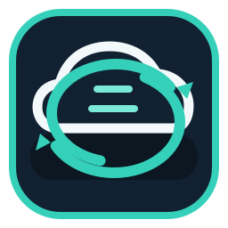
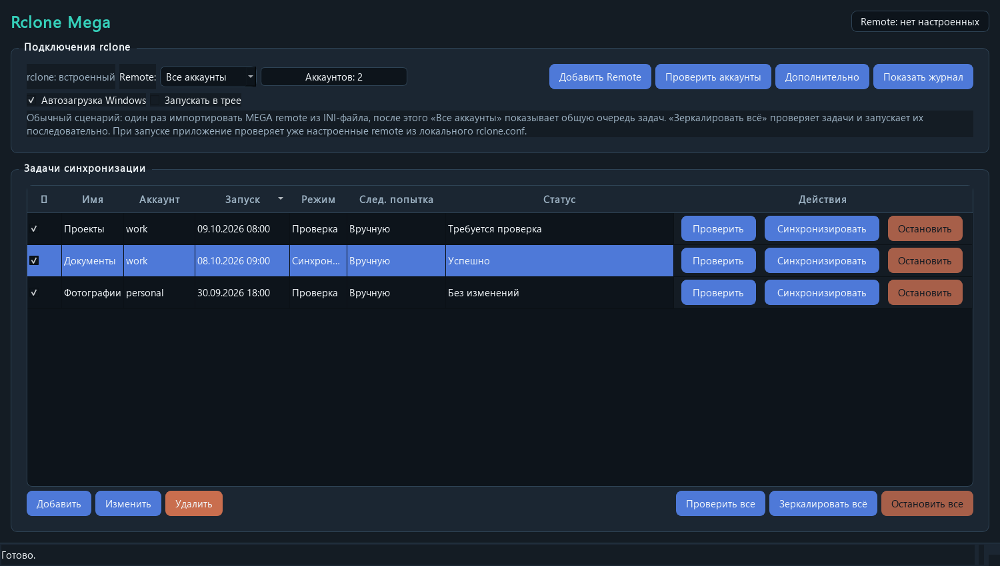
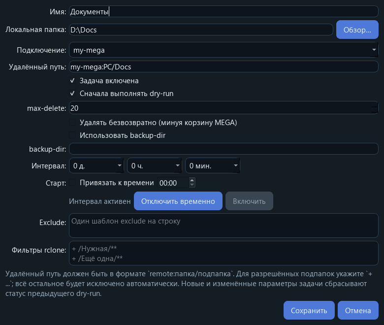

<p align="center"></p>
<h1 align="center">Rclone Mega</h1>
<p align="center">A Windows desktop app for safe, confirmed mirroring of local folders to MEGA with rclone.</p>
<p align="center"><a href="README.md">Русский</a> · <a href="README.en.md">English</a> · <a href="https://github.com/Frommer-droid/Rclone-Mega/releases/latest">Download / Скачать</a></p>

Rclone Mega provides a graphical interface for `rclone sync`: it manages MEGA
remotes and sync tasks, always shows a dry run first, and starts a real mirror
only after confirmation. The regular installation already includes rclone.

## Highlights



- Sort tasks by name, account, last run, mode, next attempt, or status. Click a header again to reverse the order; dates follow chronological order.



- Opt-in permanent MEGA deletion for each task.
- Built-in exclusions for Python caches and common temporary files.

- Import one or more MEGA remotes from a local INI credentials file.
- Keep `rclone.conf` next to the application instead of relying on a global
  rclone profile.
- View all accounts in one task table, with an account column and optional
  filtering by remote.
- Mirror all enabled tasks: one dry-run batch, one shared confirmation, then
  sequential mirroring grouped by account.
- Check the selected remote and display its cloud quota.
- Review changes in a required dry run before mirroring.
- Limit deletions with `max-delete` and optionally preserve deleted files with
  `backup-dir`.
- Schedule checks by interval or time of day; use the Windows tray and
  autostart when needed.

## Quick start

1. Download the installer from the [latest release](https://github.com/Frommer-droid/Rclone-Mega/releases/latest) and install it.
2. Start `Rclone Mega.exe`.
3. Select **Add Remote** and choose a local MEGA credentials INI file.
4. Select **Check selected** to verify the remote.
5. Create a task such as `D:\Docs` → `my-mega:PC/Docs`.
6. Select **Check**. If the dry run is correct, select **Sync**.

Select **All accounts** and **Mirror all** to process all enabled tasks without
switching accounts. Review the shared confirmation after the checks finish.
Selecting an individual account limits the batch to that account.

## Requirements

- Windows 10 or 11, x64.
- A MEGA account.
- Python 3.12 only when running or building from source.
- Inno Setup 6 only when creating an installer.

## Safety model

`rclone sync` creates a mirror, so it can delete files from the cloud
destination that no longer exist locally. Rclone Mega first runs
`rclone sync --dry-run --combined -`, presents the planned changes, and asks
for confirmation. Use `max-delete = 0` to prohibit deletions, a positive value
to cap them, or `backup-dir` to retain deleted cloud files separately.

MEGA passwords are not written to `settings.json`. They are provided to
`rclone obscure` through standard input and stored only in the local
`rclone.conf` in rclone's obscured form.

## Run from source

```powershell
py -3.12 -m venv .venv
.\.venv\Scripts\python.exe -m pip install --upgrade pip
.\.venv\Scripts\python.exe -m pip install -e ".[dev]"
.\.venv\Scripts\python.exe .\rclone_mega.py
```

Use `.venv\Scripts\python.exe` as the VS Code interpreter.

After installing dependencies, open `Rclone Mega-run.cmd` in the project root.

## Build and portable copy

```powershell
.\.venv\Scripts\python.exe -m PyInstaller ".\Build_Tools\Rclone Mega.spec" --workpath .\.release-work\build --distpath .\.release-work\dist
$env:RCLONE_DIST_DIR = '.\.release-work\dist'
.\.venv\Scripts\python.exe .\Build_Tools\post_build.py
```

The onedir build is created as `Rclone Mega\`. `00_CrRel.pyw` creates the
versioned installer on the Windows Desktop and omits runtime settings,
`rclone.conf`, and logs from the installer staging area.

`00_Move.pyw` copies the portable build to `C:\Portable\Rclone Mega` by
default. Set `RCLONE_MEGA_PORTABLE_DIR` locally to choose another parent folder.

## Limitations

- This application uses `rclone sync`, not `bisync`.
- It does not call the MEGA API directly.
- Credentials and runtime configuration stay local; include them in your own
  private backup if you move to another computer.

## License

The project's own source code is licensed under [MIT](LICENSE). The bundled
rclone notice remains in `vendor/rclone/LICENSE.txt`.

## Exclusions and deletion

Python caches (`__pycache__`, `*.pyc`, `*.pyo`, `.pytest_cache`, `.ruff_cache`,
`.mypy_cache`) and common temporary files (`Thumbs.db`, `.DS_Store`, `*.tmp`,
`*.temp`, `*.swp`, `~$*`) are excluded automatically, before custom include filters.
Already excluded files in the cloud are retained.

Permanent MEGA deletion is off by default. Enable it per task to bypass the
MEGA rubbish bin. With `backup-dir`, files move to the backup directory instead.
The mandatory dry run and confirmation still apply.

Tasks can use different MEGA remotes in one window and run sequentially.
